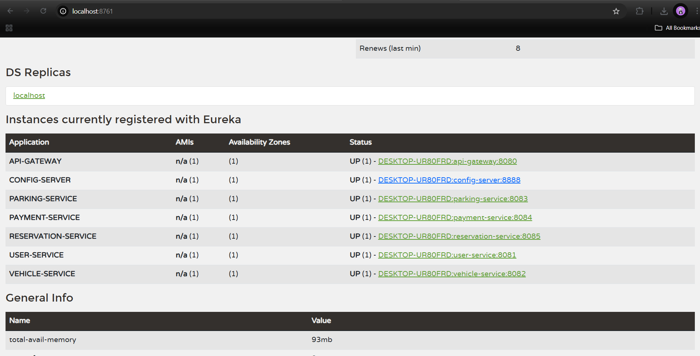

# Smart Parking Management System 🚗

A Microservices-based system developed with Spring Boot, Spring Cloud, Eureka, and JWT Security.  
It manages user registration, vehicle entry/exit, parking space allocation, reservations, and payments using a secure and scalable architecture.

---

## 📁 Project Structure

Smart-Parking-Management-System/

├── api-gateway/

├── config-server/

├── eureka-server/

├── user-service/

├── vehicle-service/

├── parking-service/

├── reservation-service/

├── payment-service/

├── Smart-Parking-Management-System.postman_collection.json

├── README.md

└── docs/

└── screenshots/

└── eureka_dashboard.png

---

## ⚙️ Microservices Overview

| Service                 | Description                                                    |
|-------------------------|----------------------------------------------------------------|
| **API Gateway**         | Central entry point with routing & JWT filters                 |
| **User Service**        | Handles registration, login, profile                           |
| **Vehicle Service**     | Manages vehicle info linked to users                           |
| **Parking Service**     | Lists, updates, and filters parking spaces                     |
| **Reservation Service** | Handles reservation logic and space status                     |
| **Payment Service**     | Processes payments and generates PDF receipts                  |
| **Eureka Server**       | Service registry for all microservices                     |
| **Config Server**       | Centralized configuration for all microservices via Git        |

---

## 📬 How to Run

1. Start **eureka server**
2. Start all microservices
3. Open Postman and use the below collection to test endpoints
4. Visit `http://localhost:8761` to verify service registration

---

## ✅ Submission Resources

- 🔗 **Postman Collection:**  
  [Postman Collection](./postman_collection.json)

- 🖼️ **Eureka Dashboard Screenshot:**  
  

---

## 🧪 Technologies Used

- Java 17
- Spring Boot
- Spring Cloud Gateway
- Spring Security + JWT
- Eureka Discovery
- RestTemplate / WebClient
- MySQL
- Lombok
- Postman
- PDF Receipt Generation (iText)

---

## 🙋 Author

Developed by: **Nimasha Shehani**  
Course: AD2 – Advanced Java Development

---

## 📌 Notes

- All endpoints are secured with JWT
- Roles: `USER`, `OWNER` used for authorization
- `PATCH` status & PDF receipt generation implemented
